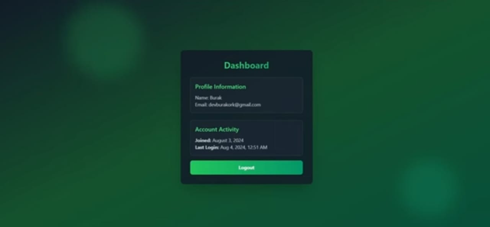

### Setup .env file

```bash
MONGO_URI=your_mongo_uri
PORT=5000
JWT_SECRET=your_secret_key
NODE_ENV=development

MAILTRAP_TOKEN=your_mailtrap_token
MAILTRAP_ENDPOINT=https://send.api.mailtrap.io/

CLIENT_URL= http://localhost:5173
```

### Run this app locally

```shell
npm run build
```

### Start the app

```shell
npm run start
```
## Screenshots

### 1. Signup
.png)

### 2. emailverification
.png)

### 3. login
.png)

### 4. dashboard



